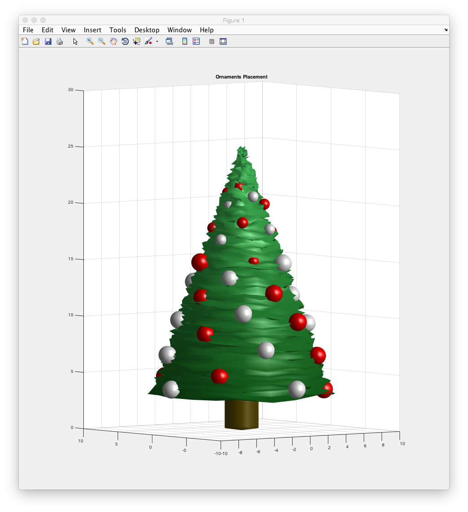

christmasSpirit
===

I was at home the other day and it was time to assemble the tree. 

Some people find it amusing to just throw ornaments on the tree on random order.

They are mad!

To fix this bug with Christmas I spent a Monday night to make kind of a solution.

# Installation

Load these functions on your Matlab working directory. 

# Usage

```MATLAB
christmasSpirit(50) % 50 or whatever, is the number of ornaments we have.
```
Result:



---

Merry Christmas and eat a lot of food!
